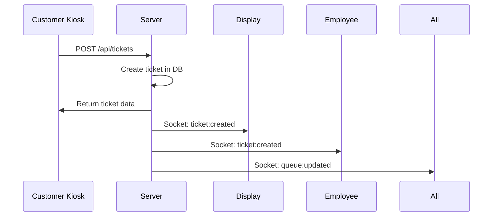
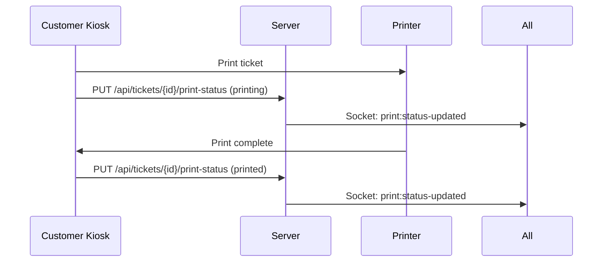
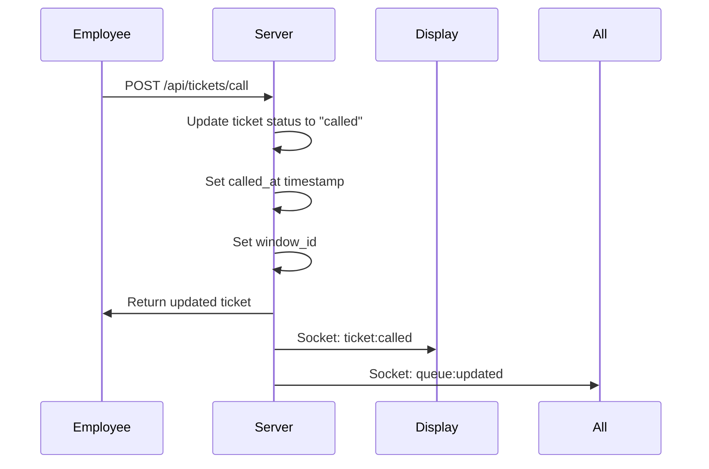
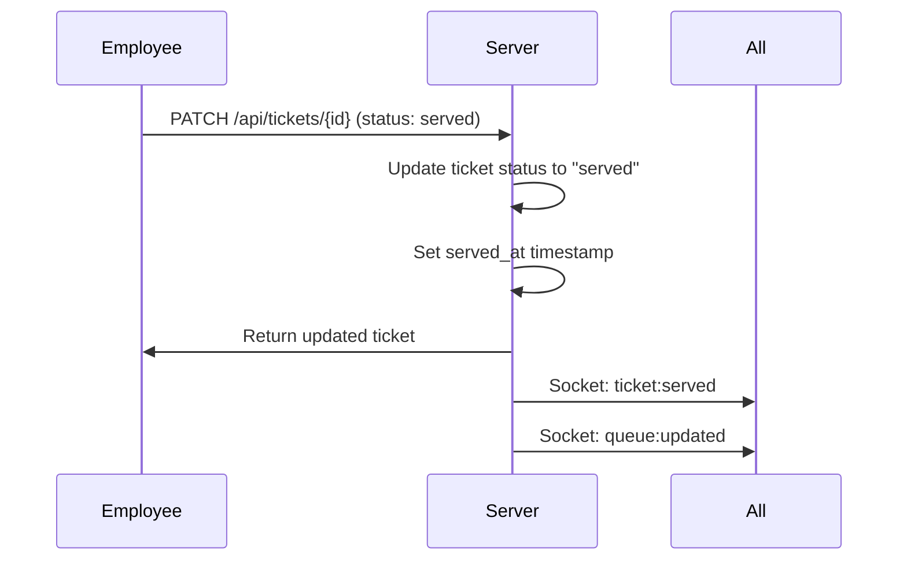

# 📋 مراجعة شاملة لنظام إدارة الطوابير CASNOS

## 🏗️ معمارية النظام

### البنية العامة
```
┌─────────────────┐    ┌─────────────────┐    ┌─────────────────┐
│  Customer App   │    │   Display App   │    │ Employee Apps   │
│   (Electron)    │    │   (Electron)    │    │   (Electron)    │
└─────┬───────────┘    └─────┬───────────┘    └─────┬───────────┘
      │                      │                      │
      └──────────────────────┼──────────────────────┘
                             │
        ┌─────────────────────▼─────────────────────┐
        │         CASNOS Server (Node.js)          │
        │  ┌─────────────┐  ┌─────────────────────┐ │
        │  │ Express API │  │ Socket.IO Real-time │ │
        │  └─────────────┘  └─────────────────────┘ │
        │  ┌─────────────┐  ┌─────────────────────┐ │
        │  │ SQLite DB   │  │ UDP Discovery       │ │
        │  └─────────────┘  └─────────────────────┘ │
        └───────────────────────────────────────────┘
```

## 📊 قاعدة البيانات

### جداول رئيسية:

1. **tickets** - التذاكر
   - `id`: معرف فريد
   - `ticket_number`: رقم التذكرة (نسبي لليوم)
   - `service_id`: معرف الخدمة
   - `status`: 'pending' | 'called' | 'served'
   - `print_status`: 'pending' | 'printing' | 'printed' | 'print_failed'
   - `created_at`: وقت الإنشاء
   - `called_at`: وقت الاستدعاء (NULL إذا لم تُستدعى)
   - `served_at`: وقت الخدمة (NULL إذا لم تُخدم)
   - `window_id`: معرف الشباك (NULL إذا لم تُستدعى)

2. **services** - الخدمات
   - `id`: معرف فريد
   - `name`: اسم الخدمة
   - `created_at`, `updated_at`: أوقات الإنشاء والتحديث

3. **windows** - الشبابيك
   - `id`: معرف فريد (يُستخدم كرقم الشباك)
   - `active`: حالة النشاط (1/0)
   - `created_at`, `updated_at`: أوقات الإنشاء والتحديث

4. **devices** - الأجهزة
   - `id`: معرف فريد
   - `device_id`: معرف الجهاز (فريد)
   - `device_type`: 'customer' | 'display' | 'employee'
   - `name`: اسم الجهاز
   - `status`: 'online' | 'offline'
   - `ip_address`: عنوان IP

5. **device_printers** - طابعات الأجهزة
   - `id`: معرف فريد (مفتاح رئيسي)
   - `device_id`: معرف الجهاز (مرجع لجدول devices)
   - `printer_id`: معرف الطابعة (فريد لكل طابعة)
   - `printer_name`: اسم الطابعة المعروض
   - `created_at`: وقت الإضافة
   - `updated_at`: وقت آخر تحديث

   **ملاحظة**: يربط هذا الجدول كل جهاز بالطابعات المتصلة به، مع قيد فريد على (device_id, printer_id)

## 🔄 API Endpoints

### 🎫 تذاكر (Tickets)

#### إنشاء تذكرة
```http
POST /api/tickets
Content-Type: application/json

{
  "service_id": 1
}
```
**الاستجابة:**
```json
{
  "success": true,
  "data": {
    "id": 1,
    "ticket_number": "1",
    "service_id": 1,
    "status": "pending",
    "print_status": "pending",
    "created_at": "2025-07-04T15:44:24.000Z",
    "called_at": null,
    "served_at": null,
    "window_id": null
  }
}
```

#### استدعاء تذكرة
```http
POST /api/tickets/call
Content-Type: application/json

{
  "ticket_id": 1,
  "window_id": 1
}
```

#### خدمة تذكرة (تحديث الحالة)
```http
PATCH /api/tickets/{id}
Content-Type: application/json

{
  "status": "served",
  "window_id": 1
}
```

#### تحديث حالة الطباعة
```http
PUT /api/tickets/{id}/print-status
Content-Type: application/json

{
  "print_status": "printed"
}
```

#### جلب جميع التذاكر
```http
GET /api/tickets
```

#### جلب التذاكر المعلقة
```http
GET /api/tickets/pending
```

#### جلب تذاكر خدمة محددة
```http
GET /api/tickets/service/{serviceId}
```

#### إحصائيات النظام
```http
GET /api/tickets/statistics
```

### 🏢 خدمات (Services)

#### إنشاء خدمة
```http
POST /api/services
Content-Type: application/json

{
  "name": "خدمة عملاء عامة"
}
```

#### جلب جميع الخدمات
```http
GET /api/services
```

### 🪟 شبابيك (Windows)

#### إنشاء شباك
```http
POST /api/windows
Content-Type: application/json

{
  "active": true
}
```

#### جلب جميع الشبابيك
```http
GET /api/windows
```

### 💻 أجهزة (Devices)

#### تسجيل جهاز
```http
POST /api/devices
Content-Type: application/json

{
  "device_id": "CUSTOMER_KIOSK_01",
  "device_type": "customer",
  "name": "Customer Kiosk Terminal 1",
  "location": "Entrance Hall",
  "ip_address": "192.168.1.101"
}
```

#### جلب جميع الأجهزة
```http
GET /api/devices
```

#### تحديث حالة الجهاز
```http
PATCH /api/devices/{deviceId}/status
Content-Type: application/json

{
  "status": "online"
}
```

### 👥 موظفين (Employees)

#### جلب جميع الموظفين
```http
GET /api/employees
```

#### جلب الموظفين النشطين
```http
GET /api/employees/active
```

#### تهيئة جلسة موظف جديد
```http
POST /api/employees/initialize
Content-Type: application/json

{
  "deviceId": "EMPLOYEE_WIN_01",
  "deviceName": "Employee Window Terminal 1"
}
```

#### إنشاء شباك موظف
```http
POST /api/employees/window
Content-Type: application/json

{
  "windowNumber": "1",
  "serviceId": 1,
  "serviceName": "خدمة عملاء"
}
```

#### تعيين خدمة لموظف
```http
POST /api/employees/window/{windowNumber}/assign-service
Content-Type: application/json

{
  "serviceId": 1
}
```

#### إزالة خدمة من موظف
```http
DELETE /api/employees/window/{windowNumber}/service
```

#### جلب رقم شباك تالي متاح
```http
GET /api/employees/next-window-number
```

### 🔧 إعادة التعيين اليومي (Daily Reset)

#### حالة الإعادة اليومية
```http
GET /api/reset/status
```

#### فرض إعادة تعيين فورية
```http
POST /api/reset/force
```

#### تحديث إعدادات الإعادة اليومية
```http
PUT /api/reset/config
Content-Type: application/json

{
  "enabled": true,
  "resetTime": "00:00",
  "autoReset": true
}
```

### 🖨️ طابعات الأجهزة (Device Printers)

#### جلب طابعات جهاز محدد
```http
GET /api/devices/{deviceId}/printers
```

#### إضافة طابعة لجهاز
```http
POST /api/devices/{deviceId}/printers
Content-Type: application/json

{
  "printer_id": "THERMAL_01",
  "printer_name": "Thermal Printer 1"
}
```

#### تحديث اسم طابعة
```http
PUT /api/devices/printers/{id}
Content-Type: application/json

{
  "printer_name": "Updated Printer Name"
}
```

#### حذف طابعة من جهاز
```http
DELETE /api/devices/printers/{id}
```

### 📊 إضافية (Additional)

#### الصفحة الرئيسية للخادم
```http
GET /
```

#### فحص حالة الخادم
```http
GET /health
GET /api/health
```

#### معلومات API العامة
```http
GET /api
```

#### معلومات الشبكة
```http
GET /api/network
```

#### حالة الطابور
```http
GET /api/queue/status
```

#### إحصائيات النظام الفرعية
```http
GET /api/stats
```

#### التذاكر الحديثة (نسخة مبسطة)
```http
GET /api/tickets/recent
```

#### تصفح الشبكة البسيط
```http
GET /api/network/browse
```

#### أحداث Socket.IO للموارد
```http
GET /api/socket/events
```

## ⚡ Socket.IO Events (الأحداث الفورية)

### أحداث التذاكر

#### إنشاء تذكرة
```javascript
// الخادم يرسل:
socket.emit('ticket:created', {
  ticket: ticketData,
  service_name: "خدمة عملاء عامة",
  ticket_number: "1",
  timestamp: "2025-07-04T15:44:24.000Z"
});
```

#### استدعاء تذكرة
```javascript
// الخادم يرسل:
socket.emit('ticket:called', {
  ticket: ticketData,
  ticket_number: "1",
  service_name: "خدمة عملاء عامة",
  window_id: 1,
  window_number: 1,
  timestamp: "2025-07-04T15:44:30.695Z"
});
```

#### خدمة تذكرة
```javascript
// الخادم يرسل:
socket.emit('ticket:served', {
  ticket: ticketData,
  ticket_number: "1",
  service_name: "خدمة عملاء عامة",
  window_id: 1,
  timestamp: "2025-07-04T15:44:32.724Z"
});
```

#### تحديث حالة الطباعة
```javascript
// الخادم يرسل:
socket.emit('print:status-updated', {
  ticket: ticketData,
  ticket_number: "1",
  print_status: "printed",
  timestamp: "2025-07-04T15:44:25.000Z"
});
```

### أحداث الطابور

#### تحديث الطابور
```javascript
// الخادم يرسل:
socket.emit('queue:updated', {
  pending: 3,
  called: 1,
  served: 0,
  total: 4,
  timestamp: "2025-07-04T15:44:30.695Z"
});
```

### أحداث الأجهزة

#### تسجيل جهاز
```javascript
// العميل يرسل:
socket.emit('device:register', {
  deviceId: 'CUSTOMER_KIOSK_01',
  deviceType: 'customer',
  location: 'Entrance Hall'
});

// الخادم يرد:
socket.emit('device:registered', {
  success: true,
  device: deviceData,
  serverTime: "2025-07-04T15:44:22.000Z"
});
```

#### اتصال/انقطاع الأجهزة
```javascript
// الخادم يرسل:
socket.emit('device:connected', {
  deviceId: 'CUSTOMER_KIOSK_01',
  deviceType: 'customer',
  timestamp: "2025-07-04T15:44:22.000Z"
});

socket.emit('device:disconnected', {
  deviceId: 'CUSTOMER_KIOSK_01',
  timestamp: "2025-07-04T15:44:22.000Z"
});
```

### أحداث الموظفين

#### تهيئة جلسة موظف
```javascript
// الخادم يرسل:
socket.emit('employee:session-initialized', {
  windowNumber: "1",
  deviceId: 'EMPLOYEE_WIN_01',
  deviceName: 'Employee Terminal 1',
  timestamp: "2025-07-04T15:44:22.000Z"
});
```

#### تعيين خدمة للموظف
```javascript
// الخادم يرسل:
socket.emit('employee:service-assigned', {
  windowNumber: "1",
  serviceId: 1,
  serviceName: "خدمة عملاء عامة",
  timestamp: "2025-07-04T15:44:22.000Z"
});
```

#### إزالة خدمة من الموظف
```javascript
// الخادم يرسل:
socket.emit('employee:service-removed', {
  windowNumber: "1",
  timestamp: "2025-07-04T15:44:22.000Z"
});
```

### أحداث الموظفين

#### تهيئة جلسة موظف
```javascript
// الخادم يرسل:
socket.emit('employee:session-initialized', {
  windowNumber: "1",
  deviceId: "EMPLOYEE_WIN_01",
  deviceName: "Employee Window Terminal 1",
  timestamp: "2025-07-04T15:44:22.000Z"
});
```

#### تعيين خدمة للموظف
```javascript
// الخادم يرسل:
socket.emit('employee:service-assigned', {
  windowNumber: "1",
  serviceId: 1,
  serviceName: "خدمة عملاء",
  timestamp: "2025-07-04T15:44:22.000Z"
});
```

#### إزالة خدمة من موظف
```javascript
// الخادم يرسل:
socket.emit('employee:service-removed', {
  windowNumber: "1",
  serviceId: 1,
  timestamp: "2025-07-04T15:44:22.000Z"
});
```

#### تحديث موظف
```javascript
// الخادم يرسل:
socket.emit('employee:updated', {
  id: 1,
  window_number: "1",
  service_id: 1,
  service_name: "خدمة عملاء",
  is_active: true,
  device_id: "EMPLOYEE_WIN_01"
});
```

#### حذف موظف
```javascript
// الخادم يرسل:
socket.emit('employee:deleted', {
  id: 1,
  windowNumber: "1",
  timestamp: "2025-07-04T15:44:22.000Z"
});
```

### أحداث النظام

#### تحديث إحصائيات الطابور الفوري
```javascript
// الخادم يرسل كل 5 ثوان:
socket.emit('realtime:queue-update', {
  pending: 3,
  total: 10,
  tickets: [...],
  timestamp: "2025-07-04T15:44:22.000Z",
  serverTime: 1720098262000
});
```

#### تحديث إحصائيات سريع
```javascript
// الخادم يرسل:
socket.emit('queue:stats-update', {
  pending: 3,
  total: 10,
  timestamp: "2025-07-04T15:44:22.000Z"
});
```

#### إعادة تعيين النظام اليومي
```javascript
// الخادم يرسل عند الإعادة اليومية:
socket.emit('system:daily-reset', {
  message: "تم تنفيذ الإعادة اليومية",
  resetTime: "2025-07-04T00:00:00.000Z",
  components: {
    tickets: true,
    pdfs: true,
    cache: true
  },
  timestamp: "2025-07-04T00:00:00.000Z"
});
```

#### إشعارات للشبابيك
```javascript
// الخادم يرسل للشبابيك عند توفر تذاكر:
socket.emit('window:notification', {
  windowId: 1,
  message: "لديك تذاكر في انتظار الخدمة",
  pendingCount: 3,
  serviceId: 1,
  serviceName: "خدمة عملاء",
  timestamp: "2025-07-04T15:44:22.000Z"
});
```

## 🔄 سير العمل الكامل

### 1. إنشاء التذكرة


### 2. طباعة التذكرة


### 3. استدعاء التذكرة


### 4. خدمة التذكرة


## 🔍 ميزات النظام المتقدمة

### 1. الاكتشاف التلقائي عبر UDP
- الأجهزة تكتشف الخادم تلقائياً عبر UDP broadcast
- لا حاجة لإدخال عنوان IP يدوياً
- إعادة اتصال تلقائي عند انقطاع الشبكة

### 2. التحديثات الفورية
- جميع الأجهزة تتلقى التحديثات فوراً عبر Socket.IO
- لا حاجة لتحديث الصفحة أو استطلاع الخادم
- معلومات الطابور محدثة في الوقت الفعلي

### 3. نظام الطباعة الذكي
- دعم طابعات حرارية 80mm
- إدارة حالة الطباعة (pending → printing → printed)
- ربط الطابعات بالأجهزة عبر جدول device_printers
- طباعة فورية مع SumatraPDF
- إدارة ذكية للطابعات حسب نوع الجهاز

### 4. إدارة الطابعات والأجهزة

#### كيف يعمل ربط الطابعات:
1. **تسجيل الجهاز**: كل جهاز (customer/display/employee) يُسجل نفسه مع معرف فريد
2. **إضافة طابعات**: يمكن ربط طابعة أو أكثر بكل جهاز عبر `/api/devices/{deviceId}/printers`
3. **طابعة افتراضية**: كل جهاز يمكن أن يحدد طابعة افتراضية (`is_default: true`)
4. **تحديث معلومات**: يمكن تعديل أسماء الطابعات أو حذفها

#### أنواع الطباعة المدعومة:
- **طباعة محلية**: من جهاز Customer مباشرة
- **طباعة شبكية**: من جهاز Display للتذاكر المعلقة
- **طباعة ذكية**: اختيار تلقائي للطابعة المناسبة
- **طباعة خلفية**: معالجة طباعة متقدمة مع إعادة المحاولة

#### آلية اختيار الطابعة:
```
إذا كان هناك printer_id محدد → استخدم هذه الطابعة
↓
إذا لم يكن محدد → ابحث عن أول طابعة متاحة للجهاز
↓
إذا لم توجد طابعات → استخدم طابعة النظام الافتراضية
```

### 5. إدارة الأجهزة
- تتبع حالة الأجهزة (online/offline)
- تسجيل تلقائي للأجهزة
- مراقبة دورة القلب (heartbeat)

### 6. إدارة الموظفين
- تهيئة تلقائية لجلسة الموظف
- تعيين شبابيك تلقائياً
- ربط الخدمات بالموظفين
- تتبع حالة النشاط

### 7. نظام إعادة التعيين اليومي
- إعادة تعيين تلقائية للأرقام يومياً
- إعدادات قابلة للتخصيص
- إعادة تعيين فورية عند الحاجة

## 📊 نتائج الاختبار الشامل

### ✅ الميزات المتأكدة:

1. **إنشاء التذاكر**: ✅ يعمل بشكل صحيح
2. **حالة الطباعة**: ✅ يتم تحديثها بشكل صحيح (pending → printing → printed)
3. **استدعاء التذاكر**: ✅ يعمل مع تحديث called_at و window_id
4. **خدمة التذاكر**: ✅ يعمل مع تحديث served_at
5. **Socket.IO**: ✅ الأحداث الفورية تعمل لجميع الأجهزة
6. **قاعدة البيانات**: ✅ جميع الحقول تُملأ بشكل صحيح
7. **اكتشاف UDP**: ✅ يعمل للاتصال التلقائي
8. **إدارة الأجهزة**: ✅ تسجيل وتتبع الأجهزة يعمل
9. **إدارة الموظفين**: ✅ تهيئة وتعيين الخدمات يعمل
10. **إعادة التعيين اليومي**: ✅ نظام متكامل وقابل للتخصيص
11. **طابعات الأجهزة**: ✅ إدارة شاملة للطابعات
12. **الإحصائيات والتقارير**: ✅ معلومات مفصلة ودقيقة

### 📈 الإحصائيات من الاختبار:
- **إجمالي التذاكر**: 4
- **التذاكر المخدومة**: 4 (100%)
- **التذاكر المعلقة**: 0
- **الأجهزة المتصلة**: 4/4
- **الخدمات**: 2
- **الشبابيك النشطة**: 2/2

## 🎯 خلاصة التقييم

### نقاط القوة:
1. **نظام متكامل**: جميع المكونات تعمل معاً بسلاسة
2. **تحديثات فورية**: Socket.IO يوفر تجربة مستخدم ممتازة
3. **قاعدة بيانات قوية**: جميع البيانات محفوظة وصحيحة
4. **سهولة الاتصال**: UDP discovery يجعل الإعداد بسيطاً
5. **مرونة في التوسع**: يمكن إضافة أجهزة وخدمات بسهولة
6. **إدارة شاملة**: نظام متكامل للموظفين والطابعات
7. **موثوقية عالية**: إعادة اتصال تلقائي ومراقبة الحالة
8. **تحكم متقدم**: إعدادات قابلة للتخصيص والإدارة

### التوصيات للتطوير المستقبلي:
1. **إضافة واجهة إدارة**: لوحة تحكم شاملة للنظام
2. **تقارير متقدمة**: إحصائيات مفصلة وتقارير دورية
3. **دعم طابعات إضافية**: أنواع مختلفة من الطابعات
4. **نظام المصادقة**: تأمين الوصول للوظائف الحساسة
5. **دعم اللغات**: واجهات متعددة اللغات

## 🏁 الخلاصة النهائية

نظام CASNOS جاهز للإنتاج! جميع الميزات الأساسية والمتقدمة تعمل بشكل صحيح:
- ✅ إنشاء وإدارة التذاكر
- ✅ طباعة التذاكر مع تتبع الحالة
- ✅ استدعاء وخدمة التذاكر
- ✅ تحديثات فورية لجميع الأجهزة
- ✅ قاعدة بيانات متكاملة ومنظمة
- ✅ شبكة تواصل قوية ومرنة
- ✅ إدارة شاملة للموظفين والشبابيك
- ✅ نظام طابعات متطور
- ✅ إعادة تعيين يومي تلقائي
- ✅ إحصائيات وتقارير مفصلة

النظام مُختبر ومُتحقق من صحته ويمكن الاعتماد عليه في بيئة الإنتاج.

## 🖨️ دليل إدارة الطابعات العملي

### مثال عملي لإعداد النظام:

#### 1. تسجيل الأجهزة
```http
# جهاز العملاء
POST /api/devices
{
  "device_id": "CUSTOMER_KIOSK_01",
  "name": "Customer Kiosk 1",
  "device_type": "customer",
  "ip_address": "192.168.1.100"
}

# جهاز العرض
POST /api/devices
{
  "device_id": "DISPLAY_MAIN_01",
  "name": "Main Display",
  "device_type": "display",
  "ip_address": "192.168.1.101"
}
```

#### 2. ربط الطابعات بالأجهزة
```http
# ربط طابعة حرارية بجهاز العملاء
POST /api/devices/CUSTOMER_KIOSK_01/printers
{
  "printer_id": "THERMAL_CUSTOMER_01",
  "printer_name": "طابعة التذاكر - العملاء"
}

# ربط طابعة عادية بجهاز العرض
POST /api/devices/DISPLAY_MAIN_01/printers
{
  "printer_id": "HP_LASERJET_01",
  "printer_name": "HP LaserJet - العرض"
}
```

#### 3. سير العمل الطبيعي للطباعة
```
العميل ينشئ تذكرة → يختار الطابعة أو يستخدم الافتراضية →
طباعة فورية → تحديث print_status في قاعدة البيانات →
إشعار real-time لجميع الأجهزة
```

### نصائح إدارة الطابعات:
- **استخدم أسماء واضحة**: مثل "طابعة الاستقبال - الطابق الأول"
- **اربط طابعة لكل جهاز**: لتجنب أخطاء الطباعة
- **اختبر الطابعات**: دورياً للتأكد من عملها
- **راقب حالة الطباعة**: عبر `print_status` في التذاكر

### مراقبة ومتابعة الطابعات:

#### استعلام حالة الطابعات
```http
# جلب جميع طابعات الأجهزة
GET /api/devices/printers

# جلب طابعات جهاز محدد
GET /api/devices/CUSTOMER_KIOSK_01/printers
```

#### حل مشاكل الطباعة الشائعة:
1. **فشل الطباعة**:
   - تحقق من وجود الطابعة في النظام
   - تأكد من حالة `print_status` في قاعدة البيانات
   - اختبر SumatraPDF أو النظام البديل

2. **طابعة غير متوفرة**:
   - النظام يتحول تلقائياً للطابعة الافتراضية
   - أو يستخدم Windows default viewer كبديل

3. **تحديث معلومات الطابعة**:
   ```http
   PUT /api/devices/printers/{id}
   {
     "printer_name": "اسم جديد للطابعة"
   }
   ```

#### مميزات الطباعة المتقدمة:
- **طباعة صامتة**: بدون نوافذ أو تأكيدات
- **إعادة المحاولة**: في حالة فشل الطباعة
- **طباعة خلفية**: لا تُعطل واجهة المستخدم
- **تتبع دقيق**: لحالة كل عملية طباعة

---

## 📝 ملخص إدارة الطابعات (بسيط)

### جدول device_printers يدعم:
✅ **ربط متعدد**: طابعة واحدة أو أكثر لكل جهاز
✅ **قيود الأمان**: لا يمكن ربط نفس طابعة لنفس الجهاز مرتين
✅ **إدارة سهلة**: إضافة، تعديل، حذف طابعات عبر API
✅ **تتبع دقيق**: تواريخ الإنشاء والتحديث لكل طابعة

### تدفق الطباعة البسيط:
```
عميل ينشئ تذكرة → النظام يختار طابعة → طباعة فورية →
تحديث print_status → إشعار real-time للشاشات
```

### أنواع الطابعات المدعومة:
- **حرارية 80mm**: للتذاكر السريعة
- **ليزر/حبر**: للطباعة عالية الجودة
- **شبكية**: للطابعات المشتركة
- **محلية**: المتصلة مباشرة بالجهاز

### النظام يعمل مع:
- **SumatraPDF**: للطباعة الصامتة السريعة
- **Windows Default**: كبديل تلقائي
- **إعادة المحاولة**: عند فشل الطباعة
- **تتبع شامل**: لكل عملية طباعة

**النتيجة**: نظام طباعة موثوق وسهل الإدارة يدعم جميع أنواع الطابعات! 🎉
